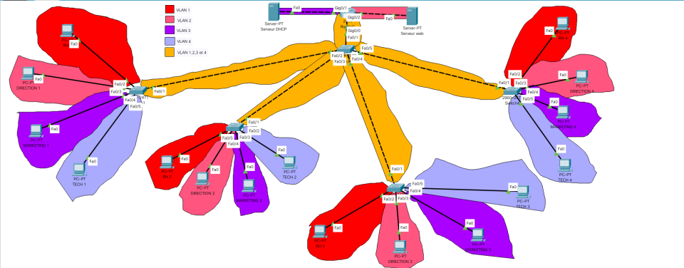
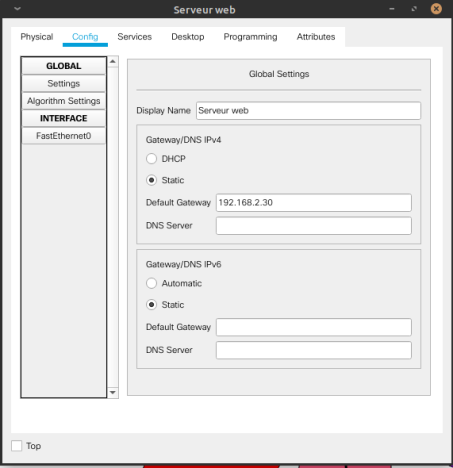
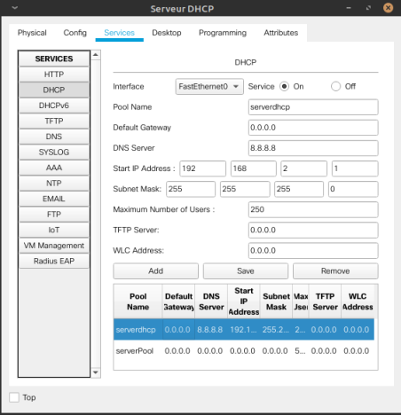

# TP1-BootCamp

## Sommaire:
[I. Présentation du sujet](#Présentation-du-sujet)  
        [I.a. Matériel & technologie utilisée](#Matériel-&-technologie-utilisée)  
        [I.b. Conditions](#Conditions)  
[II. Mise en place des Vlans et IPs](#Mise-en-place-des-Vlans-et-IPs)  
[III. Configuration des switchs](#Configuration-des-switchs)   
    [III.a. Switchs d'accès](#Switchs-d'accès)  
    [III.b. Switch de distribution](#Switch-de-distribution)  
[IV. Configuration du routeur](#Configuration-du-routeur)  
[V. Configuration des serveurs](#Configuration-des-serveurs) 
    [V.a. Serveur WEB](#Serveur-WEB)  
    [V.b. Serveur DHCP](#Serveur-DHCP)
[VI. Conclusion](#Conclusion)

## Présentation du sujet  
Mise en situation: 
L’entreprise QB Corpest divisée en 4 services:
* Ressources Humaines: 25 employés
* Direction: 5 employés
* Marketing: 250 employés
* Techniciens: 1020 employés
### Matériel  & technologie utilisée
* 5 x Switchs Cisco  2960
* 1 x Routeur Cisco 2911
* 1 x Serveur DNS
* 1 x Serveur Web
* 1 x Serveur DHCP
* 4 PC par service (16 PCs au total)
* Packet Tracer
### Conditions  
La topologie est la suivante:
* Il y a 4 switchs d’accès connectés à un switch de distribution
* Le switch de distribution est connecté au routeur
* C’est donc une architecture en 3 tiers
* Sur chaque switch sont connectés 4 PCsun de chaque service  

L’entreprise veut:
* Que chaque service soit segmenté au niveau informatique (Vlans+ IP)
* Que tous les services puissent communiquer entre eux (Les PCspeuvent tous se pinger)
* Que les liens entre les switchs d’accès et le switch de distribution possède une bande passante 4 fois    supérieure aux autres 
* Que les switchs d’accès puissent joindre le switch de distribution par un chemin secondaire voir ternaire si celui-ci ou ceux-civenaient à être défectueux, sans créer de boucle.
* Que seul le service RH puisse surfer sur le web (serveur http)
* Que le service marketing obtienne des IPsdynamiquement (dhcp)
* Que seules les 10 premières IPsdu service Techniciens puissent pinger le serveur HTTPQue les switchs possèdent des descriptions claires sur chaque port
* Que les noms des VLANssoit clairs
* Que les switchs ne puissent pas résoudre de noms dans la console

## Mise en place des Vlans et IPs  

Pour mettre en place le vlan des RH avec une place de 29 posts:
```bash
Router(config)#interface gigabitEthernet 0/2
Router(config-if)#no shut
Router(config-if)#exit
Router(config)#interface gigabitEthernet 0/2.2
Router(config-subif)#encapsulation dot1Q 2
Router(config-subif)#ip address 192.168.2.30 255.255.255.224
```

## Configuration des switchs  
### Switchs d'accès  
```bash
interface FastEthernet0/2
 switchport mode access
!
interface FastEthernet0/3
 switchport access vlan 2
 switchport mode access
!
interface FastEthernet0/4
 switchport access vlan 3
 switchport mode access
!
interface FastEthernet0/5
 switchport access vlan 4
 switchport mode access
!
```
### Switch de distribution  
```bash
interface FastEthernet0/2
 switchport trunk allowed vlan 1-4
 switchport mode trunk
!
interface FastEthernet0/3
 switchport trunk allowed vlan 1-4
 switchport mode trunk
!
interface FastEthernet0/4
 switchport trunk allowed vlan 1-4
 switchport mode trunk
!
interface FastEthernet0/5
 switchport trunk allowed vlan 1-4
 switchport mode trunk
!
```
## Configuration du routeur  
```bash
Router(config)#interface gigabitEthernet 0/1
Router(config-if)#no shutdown 
Router(config-if)#exit
Router(config)#interface gigabitEthernet 0/1.3
Router(config-subif)#no shutdown 
Router(config-subif)#encapsulation dot1Q 3
Router(config-subif)#ip address dhcp
```
Pour n'autoriser que 15 ip à passer par ici:
```bash
Router(config)#interface gigabitEthernet 0/2.4
Router(config-subif)#no shut
Router(config-subif)#encapsulation dot1Q 4
Router(config-subif)#ip address 10.1.1.14 255.255.255.240
```
## Configuration des serveurs  
### Serveur WEB  

### Serveur DHCP  


## Conclusion  